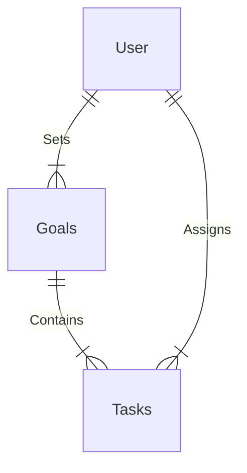

# Current Schema and Relationships

## Properties + Enums

### Goals

GoalCategory = [Personal, Work, Financial, Health, Shopping, ...]
TaskStatus = [Active, Completed, Abandoned, OnHold]
Priority = [High, Medium, Low]

| Property | Type | 
|----------|------|
| Id | SomeIDType |
| UserId | SomeIDType |
| CreatedAt | DateTime |
| UpdatedAt | DateTime |
| Name | String |
| Description | String |
| EndDate | DateTime |
| Category | [Enum] |

### Tasks

| Property | Type | 
|----------|------|
| Id | SomeIDType |
| UserId | SomeIDType |
| GoalId | Optional<SomeIDType\> |
| CreatedAt | DateTime |
| CreatedAt | DateTime |
| Name | String |
| Description | String | 
| Complete | bool |
| Priority | Optional<[Enum]> |
| Status | [Enum] |